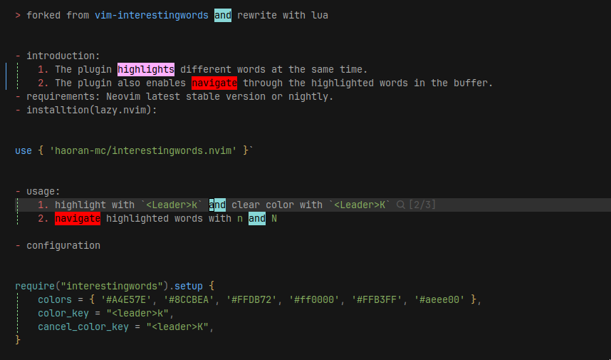

> forked from [vim-interestingwords](https://github.com/lfv89/vim-interestingwords) and rewrite with lua



- introduction:
    1. The plugin highlights different words at the same time.
    2. The plugin also enables navigate through the highlighted words in the buffer.
- requirements: Neovim latest stable version or nightly.
- installtion(lazy.nvim):

```lua
use { 'haoran-mc/interestingwords.nvim' }`
```

- usage:
    1. highlight with `<leader>k` and clear color with `<leader>K`
    2. navigate highlighted words with `n` and `N`

- configuration

``` lua
require("interestingwords").setup {
    colors = { '#A4E57E', '#8CCBEA', '#FFDB72', '#ff0000', '#FFB3FF', '#aeee00' },
    color_key = "<leader>k",
    cancel_color_key = "<leader>K",
}
```

- support lualine config:

``` lua
require('lualine').setup{
    lualine_x = {
        ...
        {
            require("interestingwords").lualine_get,
            cond = require("interestingwords").lualine_has,
            color = { fg = "#ff9e64" },
        },
        ...
    }
}
```
